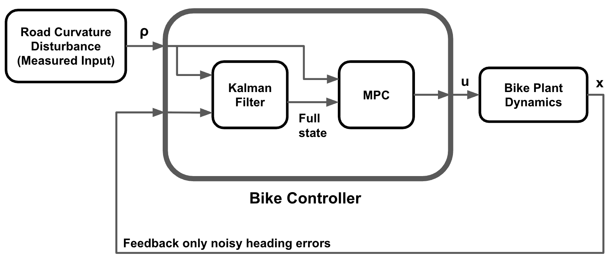
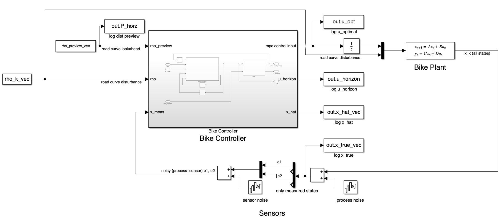

# MPC_Lane_Keeper

## Project Overview
Created a Bike Controller using a Kalman filter and Model Predictive Control (MPC) for autonomous lane tracking using a lateral bicycle model in Simulink. The road curvature is fed as an input to the bike controller block, allowing for full state estimation from the noisy heading error states, which feeds into the MPC block to solve for an optimal control sequence over a 20 step horizon. MPC is used to constrain the actuator input to within +/- 25 degrees.

## Block Diagram
A high-level block diagram of the model's structure is shown below.

  

## Simulink Model
The Simulink model is shown below, where the KF and MPC are combined into a single bike controller subsystem. The programming emphasizes codegen capability for an eventual demonstration of the bike controller logic on hardware like a Teensy.

  

## Closed Loop Simulation
A sample simulation is shown in the video below. The physical bike is shown by the black square, whereas the red dot is the state estimation from the KF. The green line shows the dynamic prediction horizon at each time step. The plot at the bottom shows the constraint on actuator limits, where the steering input never exceeds +/- 25 degrees.

https://github.com/user-attachments/assets/d0f66440-f11f-4f1f-9e1b-aff1d43e83b8
